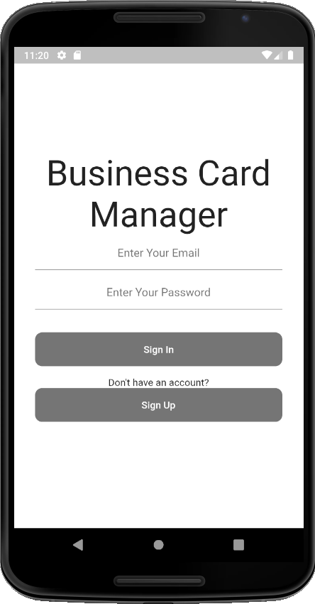
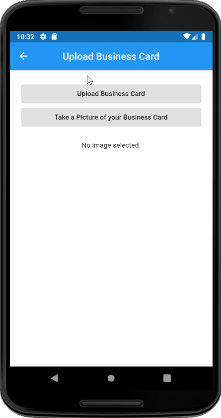
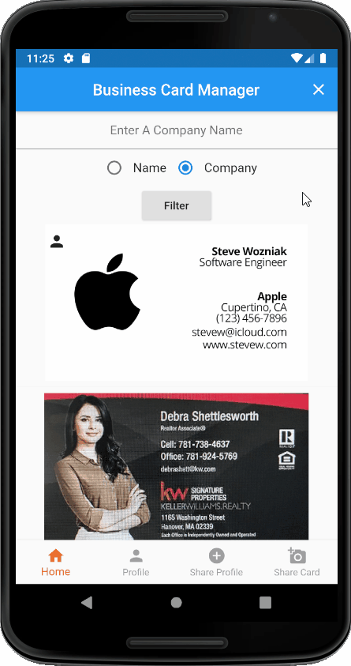
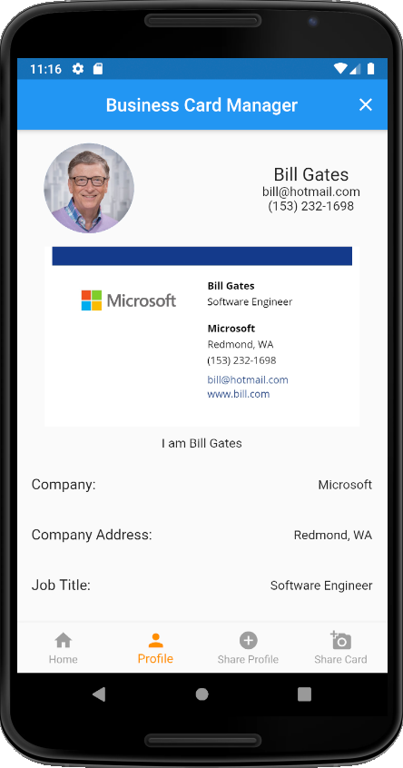
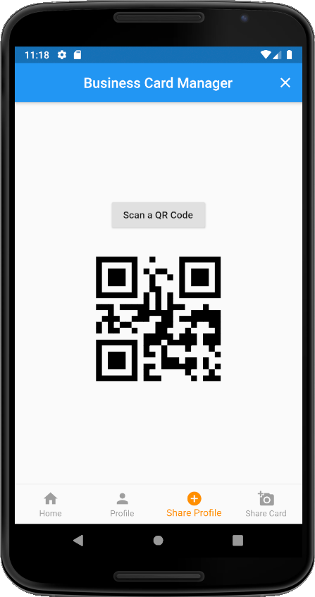
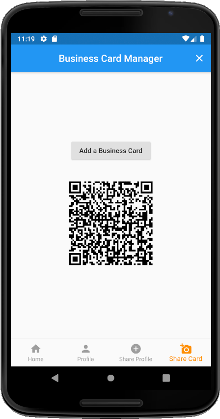

Overview
------
This is an Android app built using Flutter and Firebase. It allows you to store all you business cards in one place and filter them to find the one you're looking for. You can also upload your own card and allow people to scan a QR code to download your business card.

## Welcome Screen
   
  
## Setting Up Your Profile

   
## Looking Through Your Cards

  
## Your Profile Page

  
## Sharing Your Profile

  
## Sharing Your Card
